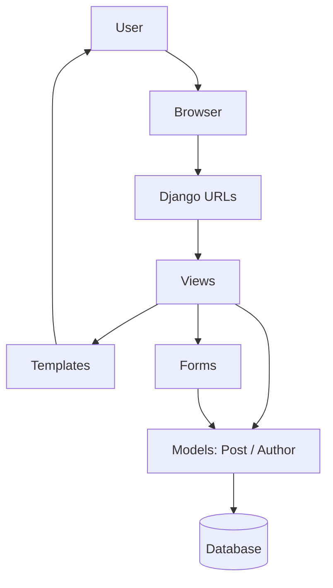

# Design Diagram

## App Structure

## Main Components
- URLs: route requests to the correct view
- Views: handle listing, detail, create, update, and delete actions
- Forms: collect and validate user input
- Models: store posts and authors
- Templates: display the user interface
- Tests: validate list, detail, create, update, and delete behaviour
